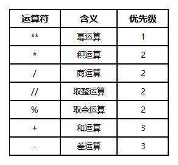
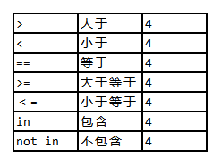
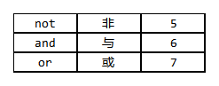
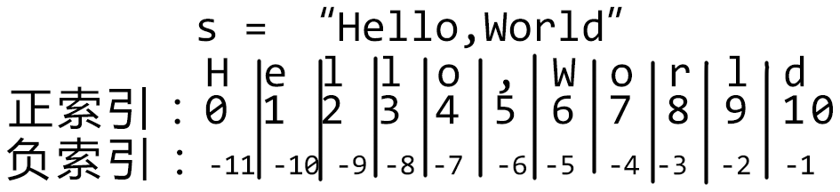
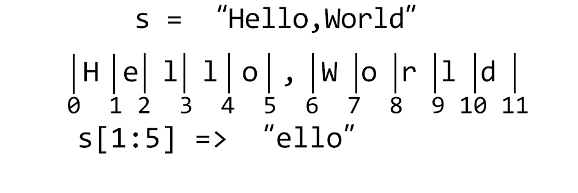
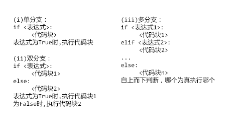

# Python基础知识

## 学前提醒
**一定记得要自己动手编程试试哦~**

## Python简介
1. 语言特点:面向对象、解释型、高级计算机程序设计语言
    - ①面向对象：使用函数与类(在后面拓展中有讲)的方式编程解决问题
    - ②解释型：在运行时，首先要将每条语句进行检查编译成机器语言(即0与1)再进行自顶而下的运行
    - ③优缺点:编写容易但运行速度较慢
2. - Python Shell：交互式解释器,输入一条执行一条,输入的语句不会被保存
    - 编辑器：输入的语句不会立刻被执行，编写完成保存并运行时才会被执行
3. - 历史(课外阅读):Python从诞生至今经历了一次大的更新换代,即Python2到Python3的飞跃。由于Python2功能的不完善,运行速度慢，维护困难等缺点，Python的创始人在C语言的基础上重新设计了Python3,与原先Python2在语法上有较大的差异，而原先的Python 2也渐渐淡出了历史舞台.我们学习的也都是Python3的语法.
    - 目前较稳定的Python版本:Python 3.8,Python3.9,Python3.10,Python3.12
    - 笔者的环境是Python3.12.0

## 输入与输出语句
1. 输入语句：`input()` 在括号内可以输入提示语
    - **注意通过`input()`得到的是字符串**


```python
a = input("请输入一串字符：")   # 输入123456
```

2. 输出语句：`print()` 括号内可以传入多个要输出的值
    - **注意：当出现运算符＋时，请一定当心加号两边的数据类型是否一致，该如何转化**


```python
print(a, type(a))   # type()用来查看a的数据类型
```

    123456 <class 'str'>
    

## 数据类型


```python
num1 = 123      # int类型 十进制
num2 = 0b100101 # int类型 二进制
num3 = 0x1a2b3c # int类型 十六进制
```


```python
float1 = 1.0    # float类型
float2 = 1e5    # float类型 科学计数法 相当于 1.0*10^5
```


```python
str1 = "I'm Li Hua"                 # str类型 由双引号引导
str2 = 'He said:"I am not good."'   # str类型 由单引号引导
str3 = '''That's a desk'''          # str类型 由三引号引导
```


```python
bool1 = True    # bool类型 真值
bool2 = False   # bool类型 假值
```

## 运算符与表达式
1. 表达式:由数字、运算符、数字分组符号、自由变量和约束变量等以能求得数值的有意义排列方法所得的组合
2. 运算符:
    - 算术运算符

        

        ***注:若C=a%b, 当b>0时C∈[0,b) 当b<0时C∈(b,0]***
    - 关系运算符

        

        ***注:链式比较 a<=b<=c ⇔ a<=b and b<=c***
    - 逻辑运算符

        

        ***注:if not flag: ⇔ if flag==False:***

## 数据结构：（也是数据类型）
- 字符串（关于转义字符可转到“关于格式化输出”）
    - 索引：从零开始的标号
    
    - 索引取值
    - 切片：格式：`s[start:end:step]`


```python
s = "Hello,World"
print(s[1])
try:
    print(s[11])    # 超出索引取值会报错 IndexError: string index out of range
except IndexError as e:
    print(e)
# 切片
s = "Hello,World"
print(s[1:5])
```

    e
    string index out of range
    ello
    

- 速会切片：

**提示：若为负索引，将其加 `len(s)` 变为正索引**

**小技巧：**

**①判断是否为空切片： 判断 `(end-start) /step` 是否大于 `0(< 0为空)`**

**②切片中的元素个数（可用来检查）`n=(end-start)//step`**
- 列表
    1. 索引、切片与字符串相同
    2. 列表方法


```python
l = ["A", "B", "C"]
print(f"{l=}")

l.append("D")   # 向列表末尾插入一位元素
print(f"{l=}")

l.insert(4, "E")    # 插入，第一个参数为索引，第二个参数为元素
print(f"{l=}")
# 超过列表长度会被加入到列表末尾,现在列表长度为5
l.insert(10, "F")
print(f"{l=}")

del_val = l.pop() # 当pop中不传入任何参数时，默认删除最后一个元素
print(f"{l=}, {del_val=}")
del_val = l.pop(3)    # 删除指定索引上的元素，会返回被删除的元素
print(f"{l=}, {del_val=}")

l.remove("E") # 删除指定元素，若存在多个，删除第一个出现的该元素
# remove没有返回值
print(f"{l=}")
```

    l=['A', 'B', 'C']
    l=['A', 'B', 'C', 'D']
    l=['A', 'B', 'C', 'D', 'E']
    l=['A', 'B', 'C', 'D', 'E', 'F']
    l=['A', 'B', 'C', 'D', 'E'], del_val='F'
    l=['A', 'B', 'C', 'E'], del_val='D'
    l=['A', 'B', 'C']
    

- 字典（也叫哈希表(Hash Table)）

    1. 键-值对(可以有相同的值)： {key1:valuel, key2:value2,...}

        - 键：*可以*是字符串、元组、整型、浮点型
          *不能*是列表、字典(它们是unhashable,不能被哈希化的)
        - 值：可以是任何类型

    2. 取值：<字典名>[<键名>]
        - 键名不在字典中会引发KeyError
    3. 字典方法


```python
d = {"A": 10, "B": 11, "C":12}
print(d.keys())     # 返回Keys对象,可迭代
print("---------")
for key in d.keys():
    print(key)
print("---------")
print(d.values())   # 返回Values对象,可迭代
print("---------")
for val in d.values():
    print(val)
print("---------")
print(d.items())    # 返回Items对象,可迭代
print("---------")
for key, val in d.items():
    print(key, val)
print("---------")
s = "1A"
for i in s:
    # get方法，若键名不在字典中，返回第二个参数
    print(d.get(i, int(i, 16)))
```

    dict_keys(['A', 'B', 'C'])
    ---------
    A
    B
    C
    ---------
    dict_values([10, 11, 12])
    ---------
    10
    11
    12
    ---------
    dict_items([('A', 10), ('B', 11), ('C', 12)])
    ---------
    A 10
    B 11
    C 12
    ---------
    1
    10
    

## 算法结构
- 顺序结构


```python
a = 1
a = 2
a = 3
print(f"{a=}")
```

    a=3
    

- 分支结构(if语句)：
    
    
    
    ***所有的分支结构只会运行至多1个(可能不运行)***
- 循环结构：(for语句与while语句)
    - while语句中注意循环控制变量的值一定要有**初值**且一定**在循环中被改变**
    - while True循环**一定有break语句**(该情况下True就是True,**不能**是等于True的其它变量)
    - break语句:结束当前整个循环
    - continue语句:进入下一趟循环


```python
for i in range(1, 3):
    if i == 2:
        break
    for j in range(1, 5):
        print((i,j), end="\t")
print()
print("---------")
for i in range(1, 5):
    for j in range(1, 11):
        if j == 2:
            break
        print((i,j), end="\t")
print()
print("---------")
for i in range(1, 4):
    if i == 2:
        continue
    for j in range(1, 3):
        print((i,j), end="\t")
print()
print("---------")
for i in range(1, 4):
    for j in range(1, 3):
        if j == 2:
            continue
        print((i,j), end="\t")
```

    (1, 1)	(1, 2)	(1, 3)	(1, 4)	
    ---------
    (1, 1)	(2, 1)	(3, 1)	(4, 1)	
    ---------
    (1, 1)	(1, 2)	(3, 1)	(3, 2)	
    ---------
    (1, 1)	(2, 1)	(3, 1)	
